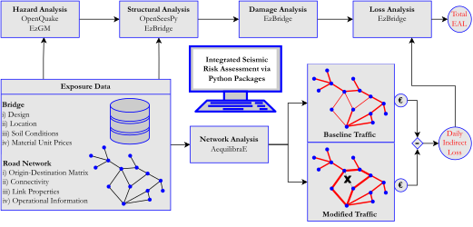

# EzBridge: Toolbox for Risk Assessment of RC Bridges

The package comprises two modules to perform structural analysis and risk calculations necessary for the foreseen integrated seismic risk assessment framework in Ozsarac [2023].

***

## EzBridge.smat: Structural Modelling and Analysis Tool
The purpose of the EzBridge.smat, as the name implies, is to generate numerical models for  ordinary RC bridges and to perform structural analysis in a practical way. It takes advantage of the open-source finite element software framework OpenSeesPy [McKenna et al. 2010; Zhu et al. 2018], which is computationally efficient and contains a large library of material models for typical civil engineering structures.

| Analysis Option  | Corresponding Method |
| ------------- | ------------- |
| Gravity  | do_gravity(*args) |
| Modal analysis | do_modal(*args) |
| Modal analysis | do_modal(*args) |
| Response spectrum analysis | do_rsa(*args) |
| Nonlinear static pushover analysis (uniform loading) | do_nspa(scheme='UNI', *args) |
| Nonlinear static pushover analysis (fundamental mode proportional loading) | do_nspa(scheme='FMP', *args) |
| Nonlinear static pushover analysis (mass proportional loading) | do_nspa(scheme='MPP', *args) |
| Nonlinear response history analysis (single record) | do_nrha(*args) |
| Nonlinear response history analysis (multiple records or sets of records) | do_msa(*args) |

***

## EzBridge.rct: Risk Calculation Tool
The general purpose of the accompanying module, EzBridge.rct, is to perform risk  calculations at the component level, utilising the site hazard curve and the outputs produced by EzBridge.smat upon conducting MSA in which the selected and scaled records matching target spectra conditioned at various IM levels are employed. Along with the loss distributions at IM levels, for which MSA is carried out, and the mean loss curve, it generates the fragility curves. Finally, scalar risk metrics EAL, EALR and MAFC, can be computed. If the daily indirect losses are computed using network analysis, the both direct and indirect loss components can be estimated at component level.

***

## Reference
Ozsarac V. Integrated Evaluation of Earthquake-Induced Economic Losses for Multi-Span Reinforced Concrete Bridges. University School for Advanced Studies IUSS Pavia, 2023.
